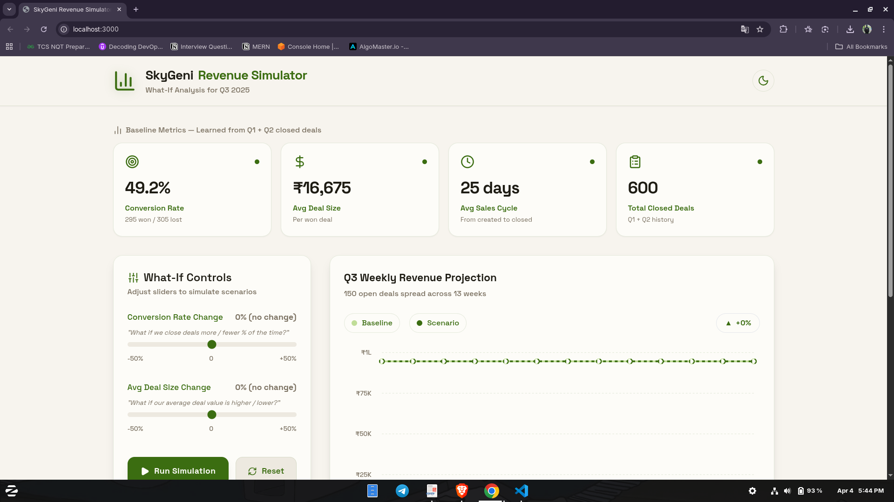
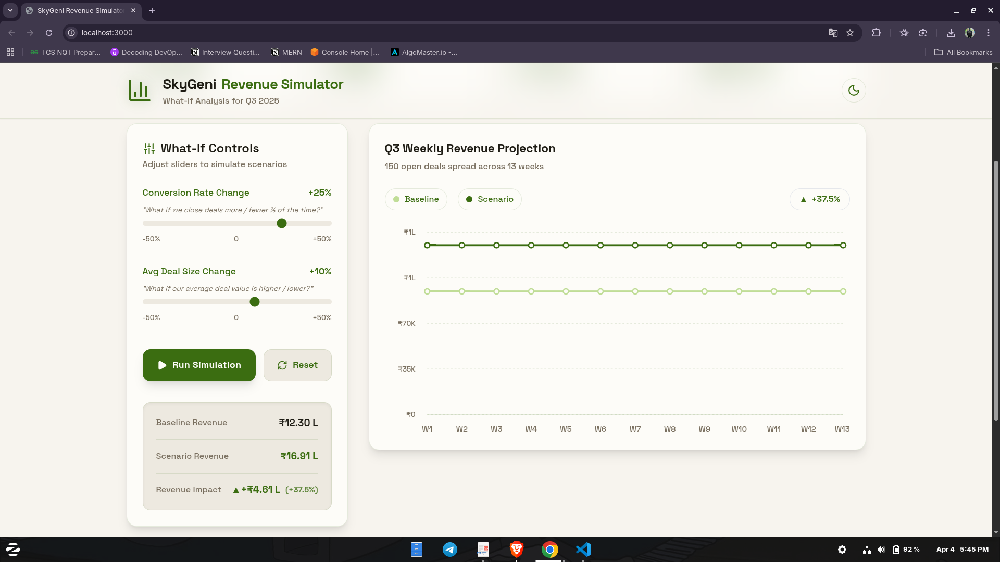
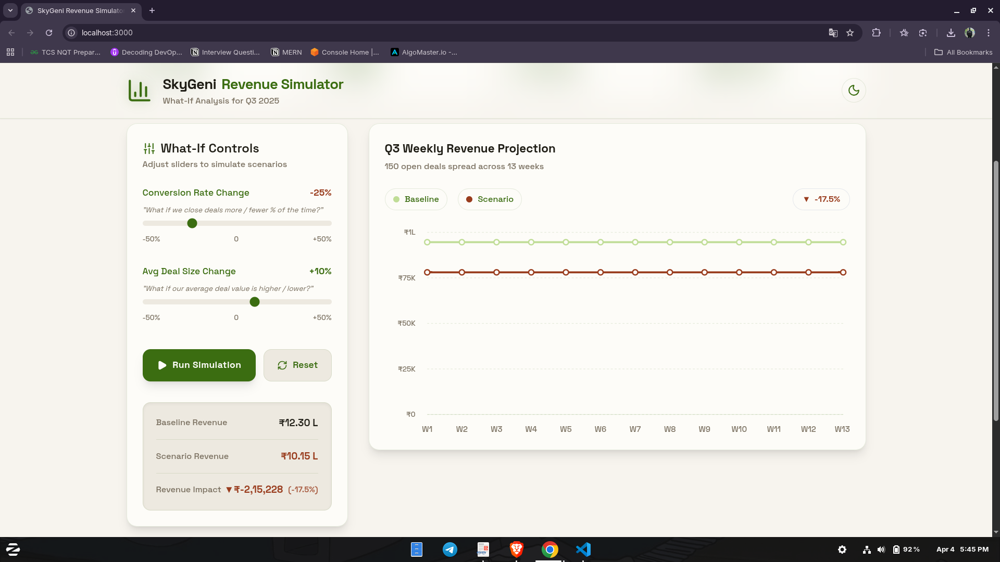
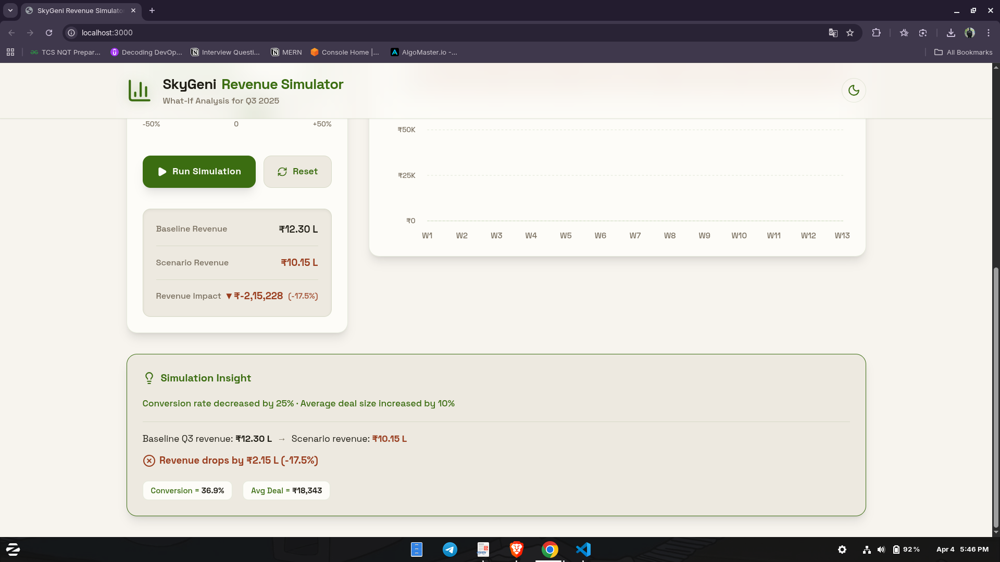
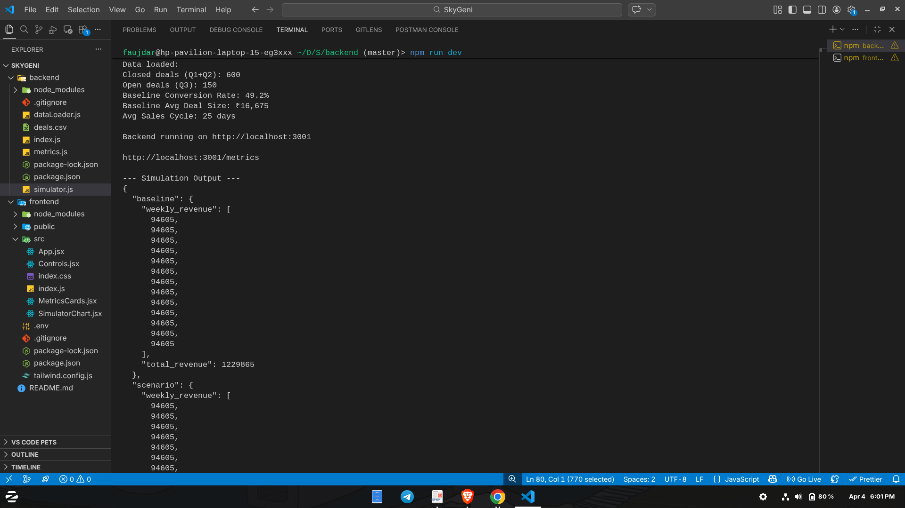
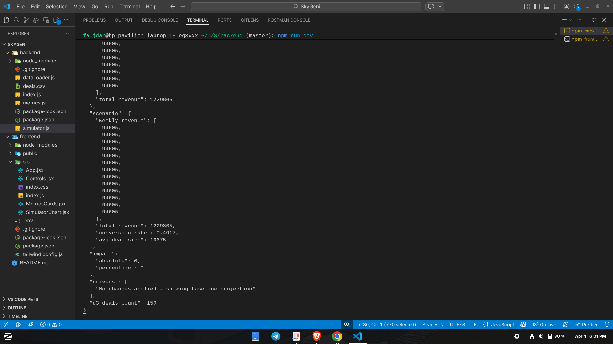

# SkyGeni What-If Revenue Simulator

A powerful, interactive sales revenue prediction tool that learns from historical closed deals (Q1 & Q2) and enables dynamic "what-if" simulations on your open sales pipeline (Q3).

---

## Key Features

- **Historical Data Analysis:** Automatically parses and analyzes past closed deals from a CSV file to establish accurate baselines for conversion rates, average deal size, and sales cycle.
- **Interactive "What-If" Simulation:** Real-time sliders allow you to tweak **Conversion Rates** and **Average Deal Sizes** to forecast the impact on future revenue.
- **Dynamic Data Visualization:** Leverages **Recharts** to plot a week-by-week comparison (Baseline vs. Scenario) across Q3.
- **Actionable Insights:** Dynamically generated text summaries breaking down the absolute and percentage impacts in plain English.
- **Modern UI/UX:** Styled comprehensively with **Tailwind CSS**, featuring **Lucide Icons** and elegant **Space Grotesk** typography for a professional, clean interface.

---

## Tech Stack

### Frontend
- **React 18** (Bootstrapped with Create React App)
- **Tailwind CSS** (Utility-first styling framework)
- **Recharts** (Declarative charts for React)
- **Lucide React** (Beautiful and consistent icons)
- **Space Grotesk Font** (Modern, clean typography)

### Backend
- **Node.js & Express** (Lightweight API server)
- **csv-parse** (Efficient CSV data processing)
- **CORS** (Cross-Origin Resource Sharing)

---

## Project Structure

```text
skygeni-simulator/
├── backend/                  
│   ├── index.js              # Express server & core API routes
│   ├── dataLoader.js         # CSV parsing into Closed (Q1/Q2) & Open (Q3) deals
│   ├── metrics.js            # Base metrics calculations (conversion rate, avg size)
│   ├── simulator.js          # The core "What-If" simulation engine logic
│   ├── deals.csv             # Raw data source
│   └── package.json          # Backend dependencies
└── frontend/                 
    ├── public/               
    │   └── index.html        # HTML entry with Space Grotesk font links
    ├── src/                  
    │   ├── App.jsx           # Main container, data fetching & unified state
    │   ├── Controls.jsx      # Simulation sliders, Run button & Insight Summary
    │   ├── MetricsCards.jsx  # Top row cards displaying baseline metrics
    │   ├── SimulatorChart.jsx# Visual Line Chart (Baseline vs Scenario)
    │   ├── index.css         # Tailwind directives & global styles
    │   └── index.js          # React DOM mounting
    └── package.json          # Frontend dependencies
```

---

## How to Run (Step by Step)

### Prerequisites
Make sure you have [Node.js](https://nodejs.org/) (LTS version recommended) installed. You can verify your installation by running:
```bash
node --version  # Recommended: v18+
npm --version   # Recommended: v9+
```

### 1. Start the Backend Server

Open your terminal, navigate to the backend directory, and start the API:

```bash
cd backend
npm install
npm start
```
*The backend will parse the `deals.csv` and boot up on `http://localhost:3001`.* 

*Example Console Output:*
```bash
Data loaded:
   Closed deals (Q1+Q2): 600
   Open deals (Q3): 150
   Baseline Conversion Rate: 49.2%
   ...
Backend running on http://localhost:3001
```

### 2. Start the Frontend Application

Open a **new** terminal tab (leaving the backend running) and start the React app:

```bash
cd frontend
npm install
npm start
```
*This will automatically launch the UI at `http://localhost:3000` in your default browser.*

---

## How to Use the Simulator

1. **Review Baselines:** Wait for the top-row metrics cards to load baseline performance metrics driven by your Q1 & Q2 data.
2. **Setup Scenarios:** 
   - Adjust the **Conversion Rate Change** slider (e.g., +10%) to simulate a more effective sales team.
   - Adjust the **Avg Deal Size Change** slider (e.g., +5%) to simulate upselling strategies.
3. **Run Simulation:** Click the **▶ Run Simulation** button.
4. **Analyze Results:** Observe the interactive chart to visualize how your tweaked scenario outpaces or lags behind the baseline trajectory over 13 weeks. Read the textual insight box for immediate contextual ROI.

---

## API Endpoints Reference

| Endpoint | Method | Description |
|----------|--------|-------------|
| `/health` | `GET` | Health check to ensure the server is alive. |
| `/metrics` | `GET` | Calculate and retrieve baseline metrics from historical data. |
| `/simulate` | `POST` | Receive scenario deltas and return projected timeline differences. |

### Example: `POST /simulate` Request
```json
{
  "conversionDelta": 10,
  "dealSizeDelta": 5
}
```

### Example: `POST /simulate` Response
```json
{
  "baseline": { "weekly_revenue": [...], "total_revenue": 1200000 },
  "scenario": { "weekly_revenue": [...], "total_revenue": 1320000 },
  "impact": { "absolute": 120000, "percentage": 10.0 },
  "drivers": ["Conversion rate improved by 10%"],
  "q3_deals_count": 150
}
```

---

## The Core Simulation Logic

The application establishes value using the following formula structure:
**Revenue = (Open Deals count) × (Baseline Conv. Rate + Delta) × (Baseline Avg Deal Size + Delta)**

**Example calculation process:**
- **Baseline:** 150 deals × 40% conversion × ₹20,000 = **₹12,00,000**
- **Scenario:** 150 deals × 44% conversion *(10% relative bump)* × ₹20,000 = **₹13,20,000**
- **Simulated Impact:** **+₹1,20,000 (+10%)**

---

## Assumptions & Key Inferences

### Data Assumptions

- **Q1/Q2 vs Q3 Split**
  The dataset does not have an explicit quarter column. The split is inferred purely from deal stage: any deal marked `Closed Won` or `Closed Lost` is treated as historical data (Q1+Q2), and any deal in `Lead`, `Qualified`, or `Proposal` stage is treated as the open Q3 pipeline. This means if a deal was created in Q1 but is still open, it gets classified as Q3 .
- **Closed Date for Sales Cycle**
  Average sales cycle is calculated only from `Closed Won` deals, not `Closed Lost`. The reasoning is that won deals represent the actual productive cycle . 
- **Missing Closed Dates**
  Open deals (`Lead`, `Qualified`, `Proposal`) have no `closed_date` in the CSV. These rows are excluded from sales cycle calculations entirely. Only rows where both `created_date` and `closed_date` are present and parseable are used.
- **Deal Value of Lost Deals**
  The `deal_value` column exists for both won and lost deals, but the simulator only multiplies won conversion rate × avg deal size.

### Simulation Assumptions

- **Uniform Distribution Across Weeks**
  Q3's 150 open deals are spread evenly across 13 weeks. This uniform distribution is a simplification to keep the weekly chart readable and the math transparent.
- **% Change is Relative, Not Absolute**
  When the user sets "Conversion Rate +10%", this means a 10% relative improvement on the baseline — not a 10 percentage point jump. So if the baseline is 49%, the scenario becomes 49% × 1.10 = 53.9%, not 59%. This matches how performance improvements actually work in sales: a 10% improvement on a 40% rate is harder to achieve than it sounds in absolute terms.
- **Both Parameters Are Independent**
  Conversion rate and deal size sliders are treated as independent variables. It assumes you can change one without affecting the other.
- **Baseline Uses Q1+Q2 Combined**
  Metrics are computed from all closed deals across Q1 and Q2 together — not separately per quarter. 


### Technical Assumptions

- **Single Data Source**
  The entire application reads from one static CSV file loaded at server startup. If `deals.csv` changes, the server must be restarted to pick up new data.
- **No Authentication**
  The API has no authentication layer. Anyone who can reach `localhost:3001` can call `/simulate`.
- **Currency**
  All deal values in the CSV are treated as a single currency (Indian Rupees, ₹). No multi-currency conversion is applied.
- **Rounding**
  Weekly revenue figures are rounded to the nearest integer using `Math.round()`.

### Inferences from the Data

After loading the actual `deals.csv` file, the simulator infers the following baseline metrics automatically:

- **Conversion Rate** — approximately 49% (295 won out of 600 closed deals)
- **Open Q3 Pipeline** — 150 deals across `Lead`, `Qualified`, and `Proposal` stages
- **Revenue Sensitivity** — a 10% improvement in conversion rate produces roughly the same revenue lift as a 10% improvement in deal size, since both are simple multipliers in the formula

These numbers are printed to the terminal when you run `node index.js`, so you can verify them against the raw CSV at any time.

---

## Demo Video

[Watch the SkyGeni Simulator Demo on Loom](https://www.loom.com/share/74c2ca8bacdb49c9b2541821855612f8)

---

## Screenshots

### Baseline State


### Positive Impact Scenario


### Negative Impact Scenario


### Insight Box


### Backend Terminal 1


### Backend Terminal 2

